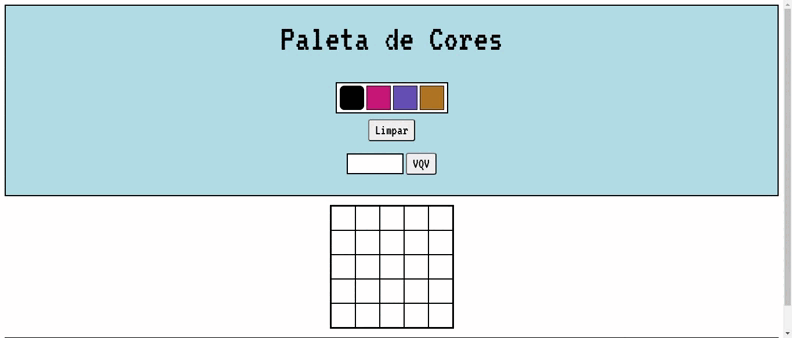

<h1 align="center"> Pixel Art </h1>
<h4 align="center"> Site para criar desenhos em <a href="https://pt.wikipedia.org/wiki/Arte_pixel">Pixel Art</a>  
  </h4>

  <a href="#funcionalidades">Funcionalidades</a> •
  <a href="#demostração">Demostração</a> •
  <a href="#tecnologias-habilidades">Tecnologias e Habilidades</a> •
  <a href="#acesso-ao-projeto">Acesso ao projeto</a> •
  <a href="#creditos">Creditos</a> •

 <h3 id="funcionalidades"> 🔨 Funcionalidades </h3>
 O site possui uma paleta de cores, que muda sempre que a pagina é atualizada, apenas cor preta é fixa.
 Possui um quadro de pixels dinamico, que usa a manipulação do DOM para criar o quadro.
 E o site possui tambem a opção de mudar o tamanho do quadro, bastando apenas digitar um numero e selecionar o botão 'VQV'. 
 Para pintar o quadro é bastante simples, selecione uma cor da paleta e depois selecione um dos pixels do quadro.

 <h3 id="demostração"> 🔭 Demostração </h3>
       
 <h3 id="tecnologias-habilidades"> 💻 Tecnologias e Habilidades usadas no Projeto </h3>
   <ul>
     <li>HTML</li>
     <li>CSS</li>
     <li>JavaScript</li>
     <li>Manipulação do DOM</li>
   </ul>
   
 <h3 id="acesso-ao-projeto"> 📁 Acesso ao projeto </h3>
     <h4>Remotamente</h4>
       
Clique no link a seguir para abrir o projeto no navegador:  
       <a href="https://yasmin358.github.io/Trybe/PixelsArt"/>https://yasmin358.github.io/Trybe/PixelsArt/</a>
       

       
Clique no link a seguir para acessar os arquivos do projeto:  
       <a href=<a href=https://github.com/Yasmin358/Yasmin358.github.io/tree/main/Trybe/PixelsArt"/>
         https://github.com/Yasmin358/Yasmin358.github.io/tree/main/Trybe/PixelsArt</a>
       

     <h4>Localmente</h4>
      

         Opção 1:  
         <a href="https://github.com/Yasmin358/Yasmin358.github.io/archive/refs/heads/main.zip">
         Clique aqui</a> para baixar os projetos  
         Abra a pasta PixelsArt para acessar os arquivos  
         Abra o arquivo index.html usando o navegador para rodar o projeto. 
          
         Opção 2:  
      

      
         # Clone este repositório
         $ git clone git@github.com:Yasmin358/Yasmin358.github.io.git

         # Acesse a pasta do projeto no terminal/cmd
         $ cd Yasmin358.github.io.git
         $ cd Trybe
         $ cd PixelArt
         
         Abra os arquivos usando o seu editor de texto favorito
         Abra o arquivo index.html usando o navegador para rodar o projeto.

 <h3 id="creditos"> ✍️ Creditos </h3>
  O projeto Pixel Art foi desenvolvido no curso de Desenvolvimento Fullstack da TRYBE, no modulo de Fundamentos, segue abaixo os requisitos do projeto:
   <h4>Obrigatórios:</h4>
   1 - Adicione à página o título "Paleta de Cores". ✔️  
   2 - Adicione à página uma paleta contendo quatro cores distintas.✔️  
   3 - Adicione a cor preta como a primeira cor da paleta de cores.✔️  
   4 - Adicione à página um quadro de pixels, com 25 pixels.✔️  
   5 - Faça com que cada elemento do quadro de pixels possua 40 pixels de largura, 40 pixels de altura e seja delimitado por uma borda preta de 1 pixel.✔️  
   6 - Defina a cor preta como cor inicial. Ao carregar a página, a cor preta já deve estar selecionada para pintar os pixels. ✔️  
   7 - Clicar em uma das cores da paleta faz com que ela seja selecionada e utilizada para preencher os pixels no quadro.✔️  
   8 - Clicar em um pixel dentro do quadro após selecionar uma cor na paleta faz com que o pixel seja preenchido com a cor selecionada.✔️  
   9 - Crie um botão que, ao ser clicado, limpa o quadro preenchendo a cor de todos seus pixels com branco.✔️  
   <h4>Bonûs</h4>
   10 - Faça o quadro de pixels ter seu tamanho definido pela pessoa usuária.✔️  
   11 - Limite o tamanho mínimo e máximo do board.✔️  
   12 - Faça com que as cores da paleta sejam geradas aleatoriamente ao carregar a página.✔️  
